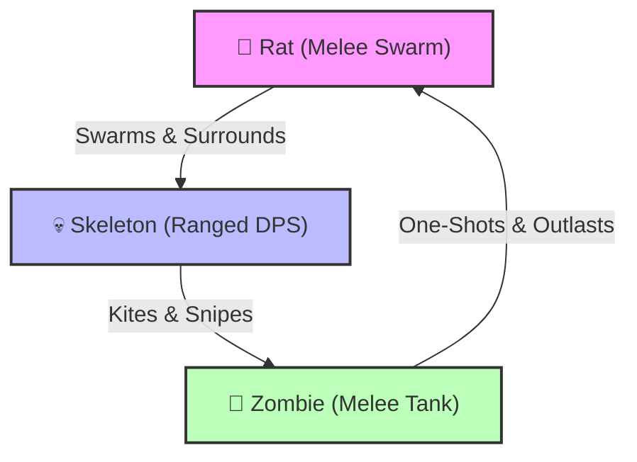

# ⚔️ Portal Clash - Summoner vs. Summoner Game Design & Balance Sheet

This document outlines the balancing specifications, mathematical formula curves, and roster design for the 3-unit progression system in **Portal Clash**, aligned with the **Summoner vs. Summoner** concept.

---

## 1. Tactical Counter Matrix

The combat is designed as a dynamic rock-paper-scissors wheel balancing **speed**, **health pools**, and **range**.



### Counter Dynamics Table

| Unit Type | Primary Target | Weakness / Hard Countered By | Tactical Role |
| :--- | :--- | :--- | :--- |
| **Rat (Swarm)** | Skeletons (ranged units) | Zombies (heavy melee splash/high HP) | Cheap, fast swarm. Used to absorb single-target hits, distract ranged targets, and overwhelm through numbers. |
| **Skeleton (Ranged)** | Zombies (slow targets) | Rats (fast swarms) | Consistent backline damage. Excels at melting slow-moving tanks before they close the distance. |
| **Zombie (Tank)** | Rats (swarms) | Skeletons (ranged kite) | High-HP frontline anchor. Slowly marches forward, absorbing massive damage and easily crushing light units. |

---

## 2. Base Unit Stats Table (Tier 1 / Level 0)

*All frame-based calculations assume a target of **60 FPS**.*

| Unit | Archetype | Mana Cost | Base HP | Base Damage | Attack Cooldown | DPS | Range | Move Speed | Gold Unlock |
| :--- | :--- | :---: | :---: | :---: | :---: | :---: | :---: | :---: | :---: |
| **Rat** `🐀` | Melee / Swarm | 3 | 20 | 5 | 0.6s (36f) | 8.3 | 15px | 2.2 px/f (132 px/s) | 0 (Free) |
| **Skeleton** `💀` | Ranged / DPS | 7 | 50 | 12 | 1.0s (60f) | 12.0 | 160px | 1.2 px/f (72 px/s) | 10 Gold |
| **Zombie** `🧟` | Melee / Tank | 15 | 180 | 25 | 1.6s (96f) | 15.6 | 25px | 0.7 px/f (42 px/s) | 25 Gold |

### Projectile Specifications (Skeleton)
- **Skeletal Arrow / Bolt:** Speed of `4.5 px/frame` (270 px/s). Single-target physical damage.

---

## 3. 3-Tier Shop Evolution Mechanics (Option A)

Upgrading a unit in the shop increases its level (up to Level 10) and automatically evolves its visual identity and capabilities when passing specific level thresholds.

```
[Level 0] ──────► [Level 1 - 3] ──────► [Level 4 - 7] ──────► [Level 8 - 10]
                  TIER 1                TIER 2                TIER 3
                  (Base Forms)          (Elite Forms)         (Mythic Forms)
```

### A. Evolution Progression

#### 🐀 Rat Roster
- **Tier 1 (Lvl 0 - 3): Tiny Rat**
  - *Description:* A small, scampering rodent.
  - *Bonuses:* Standard stat scaling ($+10\%$ HP and Damage per level).
- **Tier 2 (Lvl 4 - 7): Dire Rat**
  - *Description:* Large, aggressive sewer-beast with glowing red eyes.
  - *Bonuses:* $+\mathbf{20\%}$ flat HP/Damage evolution bonus. Movement speed increases to `2.4 px/frame` (144 px/s).
- **Tier 3 (Lvl 8 - 10): Plague Rat**
  - *Description:* A pestilent horror emitting a toxic green aura.
  - *Bonuses:* $+\mathbf{50\%}$ cumulative HP/Damage evolution bonus. Gains **Plague Aura**: deals $1$ damage per second to all enemies within $60\text{px}$.

#### 💀 Skeleton Roster
- **Tier 1 (Lvl 0 - 3): Bone Archer**
  - *Description:* A basic reanimated skeleton with a wooden bow.
  - *Bonuses:* Standard stat scaling ($+10\%$ HP and Damage per level).
- **Tier 2 (Lvl 4 - 7): Skeletal Marksman**
  - *Description:* Heavily armored skeleton wielding a composite bow.
  - *Bonuses:* $+\mathbf{20\%}$ flat HP/Damage evolution bonus. Attack range increases to $180\text{px}$.
- **Tier 3 (Lvl 8 - 10): Lich Apprentice**
  - *Description:* Levitating skeleton in dark robes, shooting magical dark energy.
  - *Bonuses:* $+\mathbf{50\%}$ cumulative HP/Damage evolution bonus. Projectiles deal $20\%$ splash damage in a $40\text{px}$ AOE around target.

#### 🧟 Zombie Roster
- **Tier 1 (Lvl 0 - 3): Zombie Walker**
  - *Description:* A slowly dragging undead corpse.
  - *Bonuses:* Standard stat scaling ($+10\%$ HP and Damage per level).
- **Tier 2 (Lvl 4 - 7): Ghoul**
  - *Description:* A hunched, feral undead with razor-sharp claws.
  - *Bonuses:* $+\mathbf{20\%}$ flat HP/Damage evolution bonus. Gains **Lifesteal**: heals for $20\%$ of all damage dealt on attack.
- **Tier 3 (Lvl 8 - 10): Zombie Abomination**
  - *Description:* A giant, stitched monstrosity twice the size of a normal unit.
  - *Bonuses:* $+\mathbf{50\%}$ cumulative HP/Damage evolution bonus. Gains **Ground Slam**: every 3rd attack deals $150\%$ damage and knocks the target back by $30\text{px}$.

---

## 4. Meta-Progression Shop Curves

### A. Unit Upgrades (HP & Damage Boost)
To account for a smaller roster of 3 units, upgrade costs scale slightly higher to ensure prolonged engagement.
- **Cost Formula:**
  $$\text{Gold Cost} = \text{Round}(\text{Current Level} \times 1.5) + 2$$
  - Level 0 $\rightarrow$ 1: 2 Gold
  - Level 1 $\rightarrow$ 2: 4 Gold
  - Level 2 $\rightarrow$ 3: 5 Gold
  - Level 3 $\rightarrow$ 4: 7 Gold
  - Level 4 $\rightarrow$ 5: 8 Gold
  - Level 5 $\rightarrow$ 6: 10 Gold
  - Level 6 $\rightarrow$ 7: 11 Gold
  - Level 7 $\rightarrow$ 8: 13 Gold
  - Level 8 $\rightarrow$ 9: 14 Gold
  - Level 9 $\rightarrow$ 10: 17 Gold
  - *Total Gold to max one unit:* **91 Gold** (273 Gold to max the entire roster).

### B. Portal HP Regen Upgrade
- **Effect:** Adds $+0.5$ HP regenerated per second (maximum Level 10, resulting in $+5.0$ HP/s).
- **Cost Formula:**
  $$\text{Gold Cost} = 8 \times (\text{Current Level} + 1)$$
  - Level 0 $\rightarrow$ 1: 8 Gold
  - Level 9 $\rightarrow$ 10: 80 Gold
  - *Total Gold to max:* **440 Gold**.

### C. Portal Mana Regen Upgrade
- **Effect:** Adds $+0.15$ Mana regenerated per second (maximum Level 10, resulting in $+1.5$ Mana/s).
- **Cost Formula:**
  $$\text{Gold Cost} = 12 \times (\text{Current Level} + 1)$$
  - Level 0 $\rightarrow$ 1: 12 Gold
  - Level 9 $\rightarrow$ 10: 120 Gold
  - *Total Gold to max:* **660 Gold**.

### D. Gold Payout Scaling (Level Reward)
Gold payouts scale with the player level cleared to balance the shop economy:
- **Base Gold Payout:**
  $$\text{Gold Earned} = \min\left(10, \left\lfloor 1 + \frac{\text{Level}}{2.5} \right\rfloor\right)$$
  - Level 1: 1 Gold
  - Level 3: 2 Gold
  - Level 5: 3 Gold
  - Level 8: 4 Gold
  - Level 10: 5 Gold
  - Level 15: 7 Gold
  - Level 20: 9 Gold
  - Level 23+: 10 Gold
- **Flawless Victory Bonus:** $+100\%$ Gold (doubled payout) if Player Portal HP is kept at $100\%$ throughout the battle.

---

## 5. Enemy Summoner AI Scaling Curves

### A. AI Mana Regeneration Scaling
The AI mana regeneration scales at a slightly higher compound rate of $7\%$ per level because the player has fewer unit types to manage, making tactical counters easier to deploy.
- **Base Passive Regen:** 1.0 mana/sec.
- **Level Scaling Formula:**
  $$\text{Actual AI Regen Rate} = 1.0 \times 1.07^{(\text{Level} - 1)}$$
  
#### AI Regen Curve Comparison:
- **Level 1:** 1.00 mana/sec (Equal to Player base)
- **Level 5:** 1.31 mana/sec
- **Level 10:** 1.84 mana/sec
- **Level 20:** 3.62 mana/sec
- **Level 30:** 7.11 mana/sec *(Player maxes base at 2.5 mana/sec; must buy in-game Temp Mana Boosts to compete)*
- **Level 50:** 27.59 mana/sec *(Endgame boss level)*

### B. AI Unit Spawning Weights
The AI chooses units dynamically based on weights that shift towards heavier tanks and ranged marksmen as levels increase. Let $L$ represent the current level.

- **Rat Weight ($W_1$):**
  $$W_1(L) = \max(20, 100 - 8 \times (L - 1))$$
- **Skeleton Weight ($W_2$):**
  $$W_2(L) = \begin{cases} 0 & \text{if } L < 3 \\ \min(40, 15 \times (L - 2)) & \text{if } L \ge 3 \end{cases}$$
- **Zombie Weight ($W_3$):**
  $$W_3(L) = \begin{cases} 0 & \text{if } L < 6 \\ \min(40, 12 \times (L - 5)) & \text{if } L \ge 6 \end{cases}$$

When spawning, the AI pools the active weights for affordable units to decide which unit to spawn.

### C. AI In-game Economy Upgrades
- **Upgrade Cost:**
  $$\text{AI Upgrade Cost} = \left\lfloor 15 \times 1.07^{(\text{Level} - 1)} \times 1.5^{\text{Upgrades Count}} \right\rfloor$$
- **Regen Increment:** Adds $+1.0 \times 1.07^{(\text{Level}-1)}$ mana/sec to its regeneration rate.
