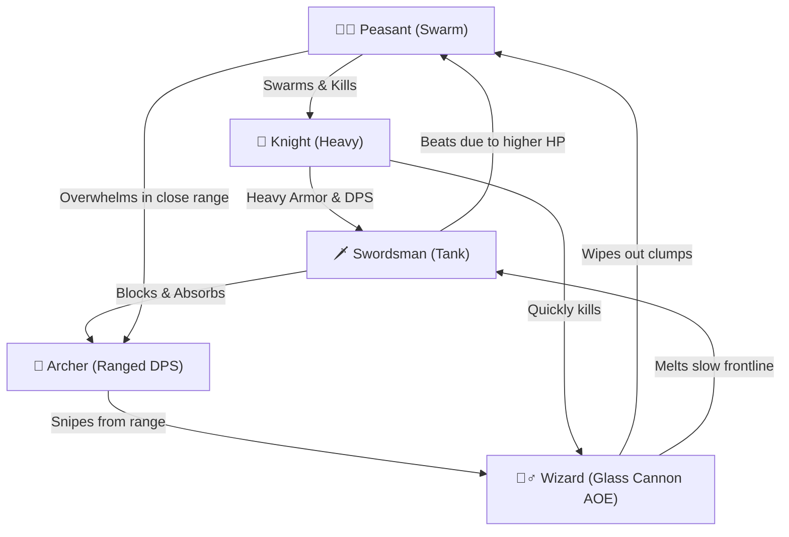

# ⚔️ Portal Clash - Game Design & Balance Sheet

This document outlines the balancing specifications, mathematical formula curves, and roster design for the 5-tier unit progression in **Portal Clash**.

---

## 1. Tactical Counter Matrix

The combat in Portal Clash centers around a hybrid rock-paper-scissors-lizard-spock combat wheel combining **range**, **health pool (armor)**, and **area-of-effect (AOE)**.

### Counter Dynamics Table

| Unit Type | Primary Target | Weakness / Hard Countered By | Tactical Role |
| :--- | :--- | :--- | :--- |
| **Peasant (Swarm)** | Knights, slow single-target units | Wizards (AOE), Swordsmen | Cheap fodder, space clogging, and absorbing heavy hits. |
| **Archer (Ranged DPS)** | Wizards, slow heavy melee (from afar) | Peasants (if swarmed), Swordsmen (high block/HP) | Fragile rear line damage. Needs frontline protection to shine. |
| **Swordsman (Tank)** | Peasants, Archers (closes gap) | Knights, Wizards | Sturdy frontline defense. Absorbs physical ranged hits. |
| **Knight (Heavy Melee)** | Swordsmen, Wizards (close range) | Peasants (swarm block), Archers (kite damage) | Main damage-dealer and pusher. Slow but devastating. |
| **Wizard (Glass Cannon)** | Peasants, clustered frontlines | Archers (long-range single-target DPS) | Ranged magical area damage. Extremely vulnerable if bypassed. |

---

## 2. Base Unit Stats Table

*All frame-based calculations assume a target of **60 FPS**.*

| Unit | Archetype | Mana Cost | Base HP | Base Damage | Attack Cooldown | DPS | Range | Move Speed | Gold Unlock |
| :--- | :--- | :---: | :---: | :---: | :---: | :---: | :---: | :---: | :---: |
| **Peasant** `🧑🌾` | Melee / Swarm | 3 | 30 | 6 | 1.0s (60f) | 6.0 | 20px | 1.8 px/f (108 px/s) | 0 (Free) |
| **Archer** `🏹` | Ranged / DPS | 6 | 40 | 12 | 0.8s (48f) | 15.0 | 150px | 1.3 px/f (78 px/s) | 5 Gold |
| **Swordsman** `🗡️` | Melee / Tank | 12 | 120 | 18 | 1.2s (72f) | 15.0 | 25px | 1.1 px/f (66 px/s) | 15 Gold |
| **Knight** `🐎` | Melee / Heavy | 22 | 250 | 35 | 1.5s (90f) | 23.3 | 30px | 0.8 px/f (48 px/s) | 35 Gold |
| **Wizard** `🧙‍♂️` | Ranged / AOE | 35 | 70 | 25 | 2.0s (120f) | 12.5 | 220px | 0.9 px/f (54 px/s) | 60 Gold |

### Projectile Specifications
- **Archer (Arrow):** Speed of `5.0 px/frame` (300 px/s). Single-target physical damage.
- **Wizard (Magic Bolt):** Speed of `4.0 px/frame` (240 px/s). Area-of-effect magical blast. Splash radius: `50px` (deals 100% damage to all enemy units within radius of impact point).

---

## 3. Meta-Progression Upgrades & Shop Curves

To encourage long-term progression without hitting sudden walls, upgrade costs increase linearly or exponentially with their levels.

### A. Unit Upgrades (HP & Damage Boost)
- **Effect:** $+10\%$ to base HP and Damage per level (maximum Level 10, resulting in $+100\%$ / double base stats).
- **Cost Formula:**
  $$\text{Gold Cost} = \text{Current Level} + 1$$
- **Unlock cost per tier:**
  - Level 0 $\rightarrow$ 1: 1 Gold
  - Level 9 $\rightarrow$ 10: 10 Gold
  - *Total Gold to max one unit:* **55 Gold** (275 Gold to max all five units).

### B. Portal HP Regen Upgrade
- **Effect:** Adds $+0.5$ HP regenerated per second (maximum Level 10, resulting in $+5.0$ HP/s).
- **Cost Formula:**
  $$\text{Gold Cost} = 5 \times (\text{Current Level} + 1)$$
- **Unlock cost per tier:**
  - Level 0 $\rightarrow$ 1: 5 Gold
  - Level 9 $\rightarrow$ 10: 50 Gold
  - *Total Gold to max:* **275 Gold**.

### C. Portal Mana Regen Upgrade
- **Effect:** Adds $+0.15$ Mana regenerated per second (maximum Level 10, resulting in $+1.5$ Mana/s).
- **Cost Formula:**
  $$\text{Gold Cost} = 10 \times (\text{Current Level} + 1)$$
- **Unlock cost per tier:**
  - Level 0 $\rightarrow$ 1: 10 Gold
  - Level 9 $\rightarrow$ 10: 100 Gold
  - *Total Gold to max:* **550 Gold**.

### D. Gold Payout Scaling (Level Reward)
To match the rising costs of upgrades, gold payouts scale with the level cleared:
- **Base Gold Payout:**
  $$\text{Gold Earned} = \min\left(8, \left\lfloor 1 + \frac{\text{Level}}{3} \right\rfloor\right)$$
- **Flawless Victory Bonus:** $+100\%$ Gold (doubled payout) if Player Portal HP is kept at $100\%$ throughout the battle.

---

## 4. Enemy Orc AI Scaling Curves

The Orc AI difficulty is governed by two parameters: its **passive mana regeneration rate** and its **spawn weight matrices** (which dictate the composition of the Orc horde).

### A. AI Mana Regeneration Scaling
To prevent the game from becoming impossible at high levels, the AI mana regeneration uses a soft exponential curve rather than a harsh 10% compounding rate.
- **Base Passive Regen:** 1.0 mana/sec.
- **Level Scaling Formula:**
  $$\text{Actual AI Regen Rate} = 1.0 \times 1.06^{(\text{Level} - 1)}$$
  
#### AI Regen Curve Comparison:
- **Level 1:** 1.00 mana/sec (Equal to Player base)
- **Level 5:** 1.26 mana/sec
- **Level 10:** 1.69 mana/sec
- **Level 20:** 3.02 mana/sec
- **Level 30:** 5.42 mana/sec *(Player maxes base at 2.5 mana/sec; must use in-game Temp Mana Boosts to keep up)*
- **Level 50:** 17.42 mana/sec *(Endgame boss levels)*

### B. AI Unit Spawning Weights
The AI selects units based on a dynamic weight list that shifts towards higher-tier units as player levels increase. Let $L$ represent the current level.

- **Peasant Weight ($W_1$):**
  $$W_1(L) = \max(10, 100 - 6 \times (L - 1))$$
- **Archer Weight ($W_2$):**
  $$W_2(L) = \begin{cases} 0 & \text{if } L < 3 \\ \min(30, 10 \times (L - 2)) & \text{if } L \ge 3 \end{cases}$$
- **Swordsman Weight ($W_3$):**
  $$W_3(L) = \begin{cases} 0 & \text{if } L < 5 \\ \min(30, 10 \times (L - 4)) & \text{if } L \ge 5 \end{cases}$$
- **Knight Weight ($W_4$):**
  $$W_4(L) = \begin{cases} 0 & \text{if } L < 8 \\ \min(25, 5 \times (L - 7)) & \text{if } L \ge 8 \end{cases}$$
- **Wizard Weight ($W_5$):**
  $$W_5(L) = \begin{cases} 0 & \text{if } L < 12 \\ \min(20, 4 \times (L - 11)) & \text{if } L \ge 12 \end{cases}$$

When spawning a unit, the AI sums the available weights and rolls a random number to select a unit type, ensuring higher-tier units gradually dominate the field.

### C. AI In-game Economy Upgrades
During a match, if the AI is not in a panic state, it can choose to upgrade its mana regeneration:
- **Upgrade Cost:**
  $$\text{AI Upgrade Cost} = \left\lfloor 15 \times 1.06^{(\text{Level} - 1)} \times 1.5^{\text{Upgrades Count}} \right\rfloor$$
- **Regen Increment:** Adds $+1.0 \times 1.06^{(\text{Level}-1)}$ mana/sec to its regeneration rate.
